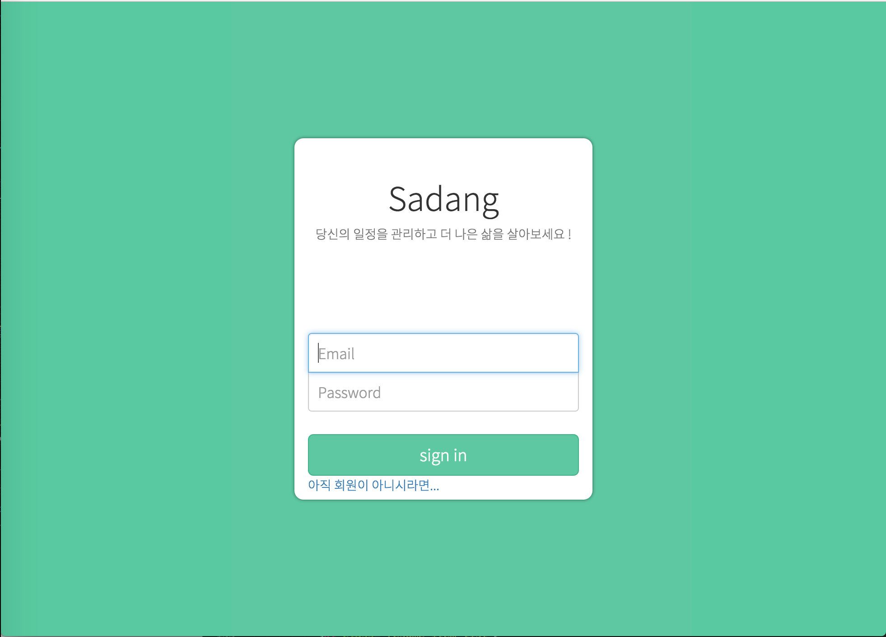
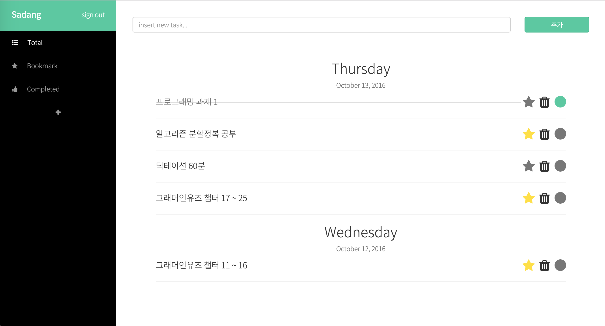

# renewal-sadang
본 프로젝트는 마이다이스아이티 챌린지 2016에서 개발한 TODO 웹 프로그램을 재구현한 프로젝트입니다. [DEMO](http://52.78.187.179:8080/todo)

## 주요기능 재구현
- [x] 회원가입 
- [x] 로그인
- [x] 할일 추가, 삭제, 수정하기
- [x] 할일 북마크, 완료하기
- [x] 카테고리 추가하기
- [ ] 할일 공유하기

## 주요화면
| 로그인 화면  | 메인 화면 |
| ------------- | ------------- |
|   |   |

## 구현
- 백엔드는 Spring, Spring Security, Hibernate를 이용하여 REST API 구성
- 프론트는 Bootstrap, LESS를 이용하여 화면 구성을 하고 JQuery, HandlebarsJS를 이용하여 AJAX 통신

## 디렉토리 구조
- java
    - org.lch
        - controller : Restful URL Mapping 및 예외 핸들링
        - domain : 할일, 유저 클래스 (POJO)
        - dto : 사용자에게 전달할 데이터를 담을 클래스
        - exception : 각종 예외 클래스 (로그인 실패, JWT 토큰 만료 등) 
        - repository : DB 액세스 (Hibernate 구현) 
        - service : 각종 비지니스 로직 (할일 추가, 삭제, 수정 등)
    - security : JWT 인증 구현 (스프링 시큐리티 기능 커스텀)
- webapp/WEB-INF
    - spring
        - appServlet
            - servlet-context.xml : Controller 빈 설정
            - test-context.xml : 테스트를 위한 빈 컨텍스트
        - root-context.xml : 서블릿 컨텍스트에서 사용하는 공통 빈 설정 (Service 빈, Repository 빈)
        - security.xml : 스프링 시큐리티 JWT 빈 설정
    - web.xml : 스프링 컨텍스트 로드 설정 및 각종 필터 설정 (스프링 시큐리티, 인코딩 필터)
    